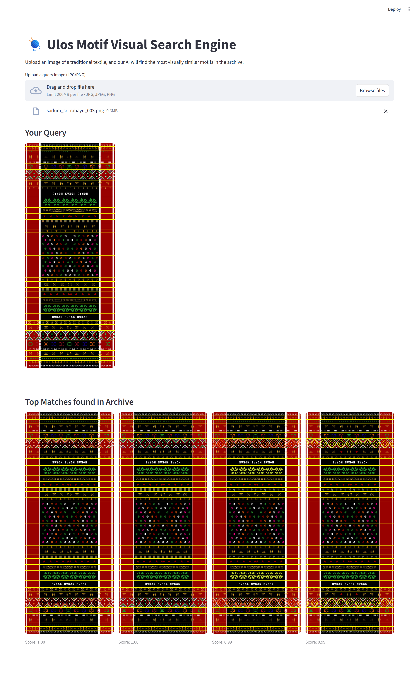

# 🧶 Ulos Motif Visual Search Engine

An educational Content-Based Image Retrieval (CBIR) application built with Python and Streamlit. 

Traditional keyword searches often fail when describing complex geometric patterns or cultural textiles. This project demonstrates how to use Deep Learning (ResNet50) to extract the "visual essence" of traditional Ulos motifs and search a digital archive using vector mathematics (Cosine Similarity) instead of text.



## 🎯 Learning Objectives
This repository is designed to help students understand:
* **Feature Extraction:** How convolutional neural networks (CNNs) convert images into mathematical embeddings (vectors).
* **Vector Search:** How to calculate the distance between data points using Cosine Similarity.
* **System Architecture:** How to separate machine learning logic (backend/indexing) from the user interface (frontend).
* **Rapid Prototyping:** How to deploy interactive data applications using Streamlit.

## 🛠️ Technology Stack
* **Frontend:** [Streamlit](https://streamlit.io)
* **Computer Vision / AI:** [PyTorch](https://pytorch.org) & [`torchvision` (Pre-trained ResNet50)](https://docs.pytorch.org/vision/stable/index.html)
* **Image Processing:** [Pillow (PIL)](https://python-pillow.github.io)
* **Similarity Computation:** [Scikit-learn](https://scikit-learn.org/stable)
* **Data Handling:** [NumPy](https://numpy.org) & [`pickle`](https://docs.python.org/3/library/pickle.html)

## 📂 Project Structure
```text
ulos_search_project/
│
├── data/
│   └── ulos_images/        # ⚠️ Add your raw Ulos image dataset here (.jpg, .png)
│
├── core/
│   ├── __init__.py
│   └── extractor.py        # Contains the ResNet50 feature extraction logic
│
├── indexer.py              # Script to pre-compute and save the image embeddings
├── app.py                  # The main Streamlit user interface
└── requirements.txt        # Python dependencies
```

## 🚀 Installation & Setup

**1. Clone the repository**
```bash
git clone https://github.com/exemuel/ulos_search_project.git
cd ulos-visual-search
```

**2. Create a Virtual Environment (Recommended)**
```bash
python -m venv venv
source venv/bin/activate  # On Windows use: venv\Scripts\activate
```

**3. Install Dependencies**
```bash
pip install -r requirements.txt
```

**4. Prepare the Dataset**
Create a folder named `data/ulos_images/` in the root directory and populate it with your dataset of traditional textile images.

## ⚙️ Usage

**Step 1: Build the Search Index**
Before running the app, you must process the image archive. This script passes every image through the AI model and saves their mathematical representations to an `embeddings.pkl` file.
```bash
python indexer.py
```
*Note: This may take a few minutes depending on the size of your dataset and your hardware.*

**Step 2: Launch the App**
Once the index (`embeddings.pkl`) is successfully created, start the Streamlit server:
```bash
streamlit run app.py
```
The app will open automatically in your browser (usually at `http://localhost:8501`). Upload a query image to see the CBIR system in action!

## 🤝 Expansion Challenges for Students
Looking to push this capstone further? Try these upgrades:
1. **Metadata Filtering:** Update the pickle database to include region data (e.g., Toba, Karo) and add a Streamlit sidebar filter to narrow down search results.
2. **Multimodal Search:** Research the OpenAI CLIP model and swap out ResNet50 to allow text-to-image searching (e.g., typing "red geometric star pattern").
3. **Performance Optimization:** Replace the Scikit-learn cosine similarity calculation with a dedicated vector database like FAISS for much faster retrieval on larger datasets.

---
*Developed for Information Systems research and educational exploration.*
```